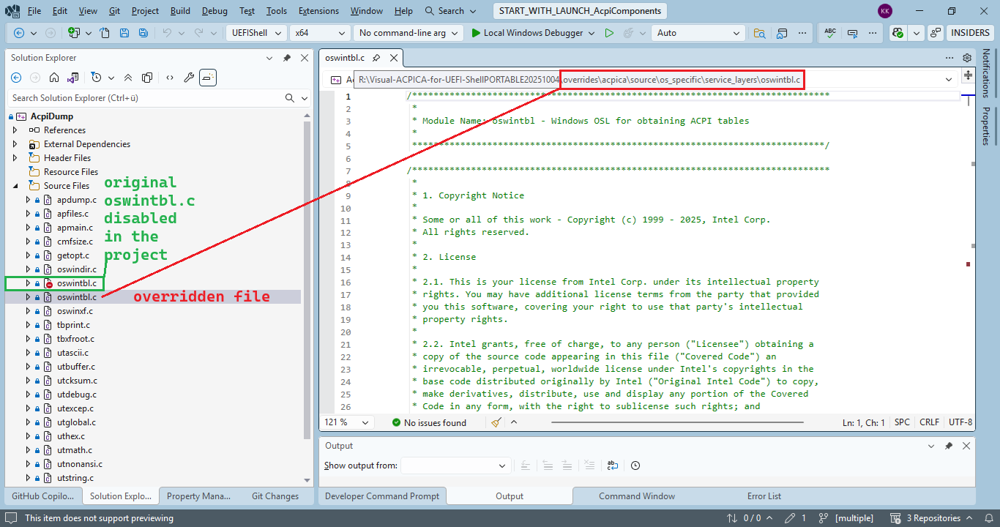
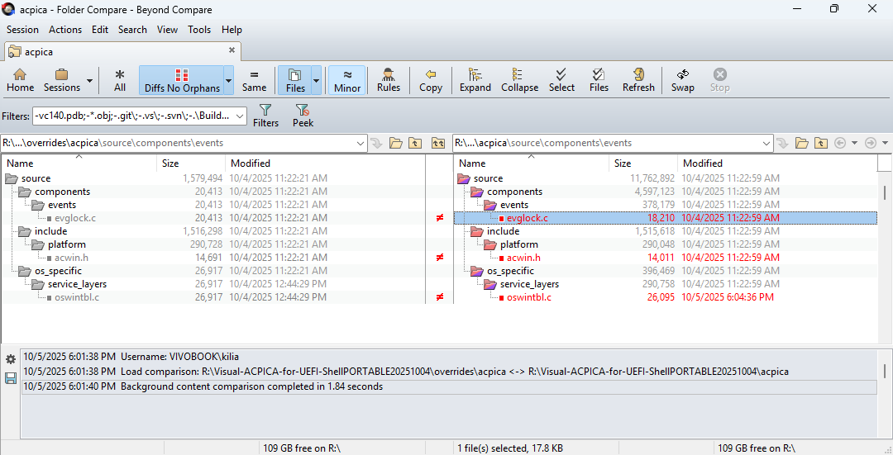
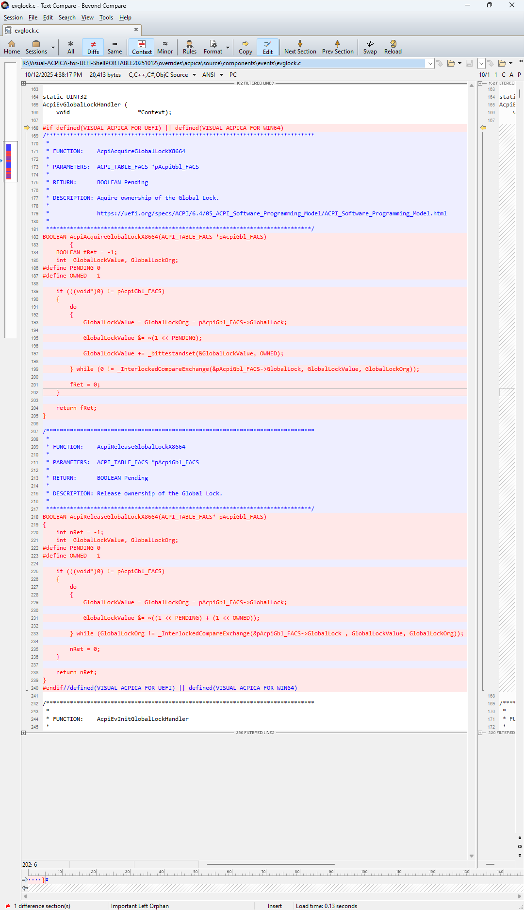
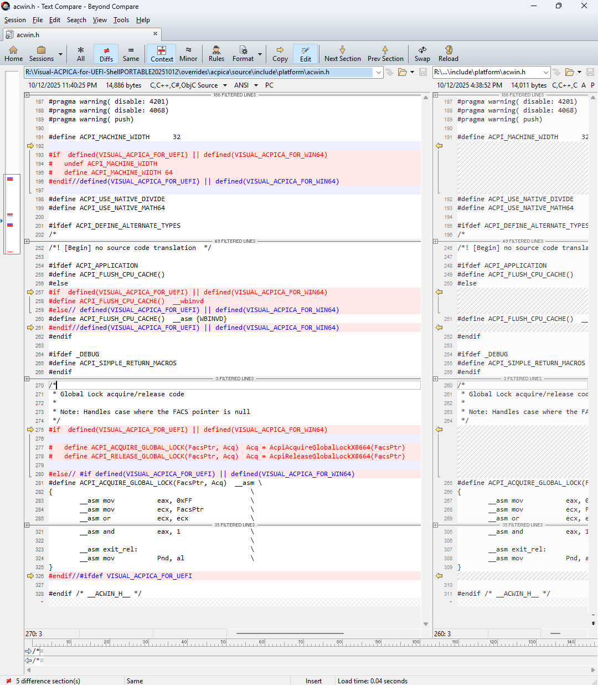
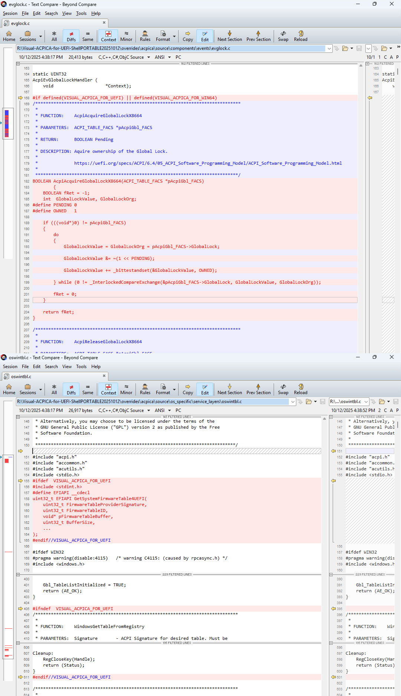

### CdePkgBlog 2025-10-05
# Refresh of the ACPICA port to UEFI

### Table of content
* [Abstract](README.md#abstract)
* [Introduction](README.md#Introduction)
    * [introductory email](https://edk2.groups.io/g/devel/message/85720?p=%2C%2C%2C20%2C0%2C0%2C0%3A%3ACreated%2C%2CCdePkgBlog%2C20%2C2%2C0%2C88470049)
    * [introductory videos](README.md#introductory-videos)
* [ACPICA](README.md#acpica--acpi-component-architecture)
    * [Original project sourcecode](README.md#original-project-sourcecode)
    * [Modified project sourcecode](README.md#modified-project-sourcecode)
        * [```aslmain.c```](README.md#aslmainc)
        * [```apmain.c```](README.md#apmainc)
        * [```evglock.c```](README.md#evglockc)
        * [```acwin.h```](README.md#acwinh)
        * [```oswindir.c```](README.md#oswindirc)
        * [```oswintbl.c```](README.md#oswintblc)
        * [```oswinxf.c```](README.md#oswinxfc)
* [Win324UEFI](README.md#win324uefi)
* [toro-C-Library](README.md#toro-c-library)
* [Starting Visual Studio 2022](README.md#starting-visual-studio-2022)
    * [Setup the buildenvironment](README.md#setup-the-buildenvironment)
    * [Build the solution in Visual Studio](README.md#build-the-solution-in-visual-studio)
* [Coming up soon](README.md#coming-up-soon)

## Abstract
Refresh of the demonstration showing how to transform the Intel ACPI reference implementation 
[**ACPICA – ACPI component architecture**](https://github.com/acpica/acpica) into **UEFI Shell** 
and **Windows 64bit** applications using **Microsoft Visual Studio 2026** and the open-source, 
monolithic, multi-target [**toro C Library**](https://github.com/KilianKegel/toro-C-Library) [<sup>1</sup>](footnotes/footnote-1.md)

The intial work was done in early 2022 here: https://github.com/tianocore/edk2-staging/tree/CdePkg/blogs/2022-01-16#introduction-of-the-acpica-port-to-uefi.

Since then various improvements have been made to the [**toro C Library**](https://github.com/KilianKegel/toro-C-Library),
the [**Visual-LIBWIN32-for-UEFI**](https://github.com/KilianKegel/Visual-LIBWIN32-for-UEFI?tab=readme-ov-file#visual-libwin32-for-uefi)
and the [**ACPICA** sourcecode](https://github.com/acpica/acpica).

## Introduction
["**ABOUT:** The ACPI Component Architecture (ACPICA) project provides an operating system (OS)-independent reference implementation of the Advanced Configuration and Power Interface Specification (ACPI)."](https://github.com/acpica/acpica)
(The sentence **"It can be easily adapted to execute under any host OS."** was included in an earlier publication.)

Intel provides the ACPICA Windows Binary Tools for free [**download**](https://www.intel.com/content/www/us/en/download/774881/acpi-component-architecture-downloads-windows-binary-tools.html) in 32Bit x86 instruction set only.

This article shows how to build the ACPICA tools as **Windows 64Bit** and **UEFI Shell** executables (the UEFI Shell is generally 64Bit) using **Visual Studio 2026**.


The Windows-API-Emulation is now significantly improved over the initial version from early 2022.<br>
The [**Visual-LIBWIN32-for-UEFI**](https://github.com/KilianKegel/Visual-LIBWIN32-for-UEFI?tab=readme-ov-file#visual-libwin32-for-uefi) library now provides 
functions with the same **WINAPI** **`__declspec(dllimport)`** calling convention like the original **WIN32-API**.<br>
This makes it possible to translate the original **ACPICA** source code with only 3 files being modified.

**Windows 64Bit** applications can be debugged easily in **Visual Studio 2026**.<br>
The **ACPICA UEFI Shell applications** differ only marginally from the Windows versions,<br> so debugging them in a UEFI environment is largely unnecessary.

### introductory videos
* build *Visual-ACPICA-for-UEFI-Shell*: https://www.youtube.com/watch?v=POfSJQXi2aM
* run *ACPIDUMP.efi* and *ASLCOMPILER.efi*: https://www.youtube.com/watch?v=oA1GA95WrF0 


## Original project sourcecode
The ACPICA reference implementation is available here: https://github.com/acpica/acpica <br>
This port is based on the version https://github.com/acpica/acpica/tree/aa98db3bd149fc1f8d2a3017cb05b6b1982c3296 from August 2025.

The x86-Windows-version is only available for an old Visual Studio version (2017)
and regrettably only for x86-32 instruction set.

The shift to x86-64 instruction set produces some warnings during compilation process
that I left open.

A datatype **```long```** can't be used on sourcecode running on Windows(32Bit and 64Bit) and Linux(32Bit and 64Bit) compilers,
because there are different data models (**Windows LLP64** vs. **Linux LP64**) for that datatype.


## Modified project sourcecode
### Modifying files of the ***acpica*** subprojects
Since the original ACPICA sourcecode is integrated into this project as a git submodule, it can't be modified directly.

The override mechanism used here just duplicates the original file into the project folder.<br>
The original file is disabled in the build process and the modified file is used instead.<br>
Each original file and its overridden version remain visible in Solution Explorer to mark the override.<br>



Only the Microsoft-specific project files have been  transferred and modified to the 
new "*VisualStudio2026 solution*" **AcpiComponents.slnx**. 

From the about 420 original .C and .H files that belong to the project, only 3 files need to be modified:



All source code modifications have been  encapsulated in the ```VISUAL_ACPICA_FOR_UEFI``` and ```VISUAL_ACPICA_FOR_WIN64```
build switch.

Additionally a couple of Windows functions need to be rewritten for UEFI usage.<br>
The library is called [**Visual-LIBWIN32-for-UEFI**](https://github.com/KilianKegel/Visual-LIBWIN32-for-UEFI?tab=readme-ov-file#visual-libwin32-for-uefi).

### [evglock.c](https://github.com/KilianKegel/Visual-ACPICA-for-UEFI-ShellPORTABLE/blob/main/overrides/acpica/source/components/events/evglock.c)
**```evglock.c```** provides the Global Lock support. The functions **```AcpiAcquireGlobalLock()```**
and **```AcpiReleaseGlobalLock()```** need to be rewritten from inline assembly language to
Microsoft C intrinsics, because for 64Bit code generator inline-assembler is not supported anymore.



### [acwin.h](https://github.com/KilianKegel/Visual-ACPICA-for-UEFI-Shell/blob/main/acpica-win-20210930-source/include/platform/acwin.h)
For the same reasons the macros in **```acwin.h```** have to be adjusted.



### [oswintbl.c](https://github.com/KilianKegel/Visual-ACPICA-for-UEFI-Shell/blob/main/acpica-win-20210930-source/os_specific/service_layers/oswintbl.c)



* [```EnumSystemFirmwareTables()```](https://github.com/KilianKegel/Visual-LIBWIN32-for-UEFI/blob/main/EnumSystemFirmwareTables.c)
* [```GetSystemFirmwareTable4UEFI()```](https://github.com/KilianKegel/Visual-LIBWIN32-for-UEFI/blob/main/GetSystemFirmwareTable.c)

with slightly different parameters instead its original Windows counter parts.

To add ```4UEFI```-suffix was a workaround to avoid a conflict with calling conventions of the original
Microsoft function definitions in the header files.


# Starting Visual Studio 2022
## Setup the buildenvironment
1. install FLEX and BISON that are required for the *AslCompiler*:<br>
   https://acpica.org/downloads/windows-source 
2. [install Visual Studio 2022](https://github.com/KilianKegel/HowTo-setup-an-UEFI-Development-PC#2-install-visual-studio-2022)

## Build the solution in Visual Studio
Once the [Visual-ACPICA-for-UEFI-Shell](https://github.com/KilianKegel/Visual-ACPICA-for-UEFI-Shell/tree/dc74325f55b02253165fb64e08d64271c99ddfcf)
repository is cloned to the build PC, just double click ```AcpiComponents.sln```. This will start Visual Studio 2022.

Just press 'F7' to build the entire solution including the **toro-C-Library** and the **Win324UEFI**
projects.

The .EFI files appear in the ```x64\UEFIShell``` folder.
